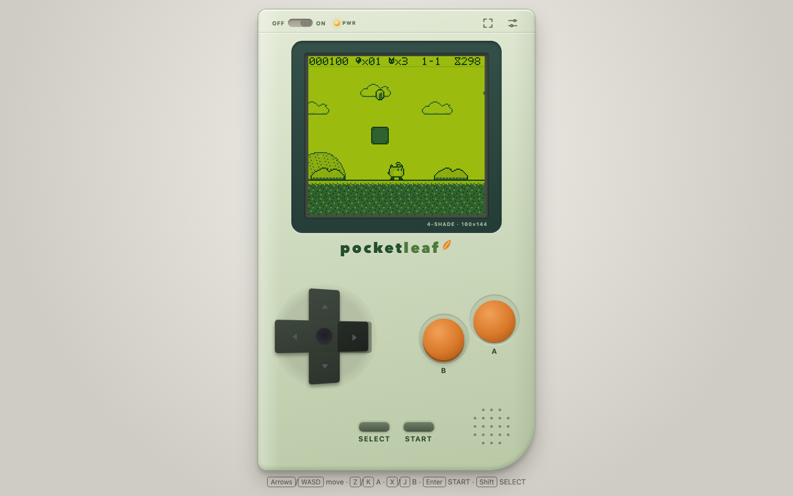
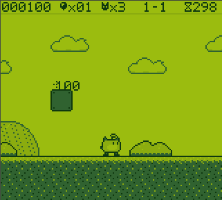
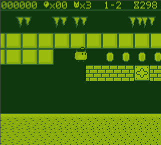
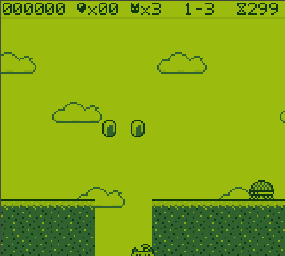
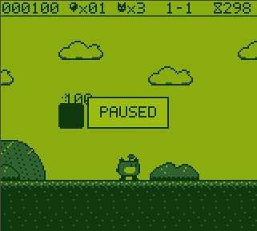
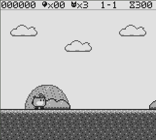
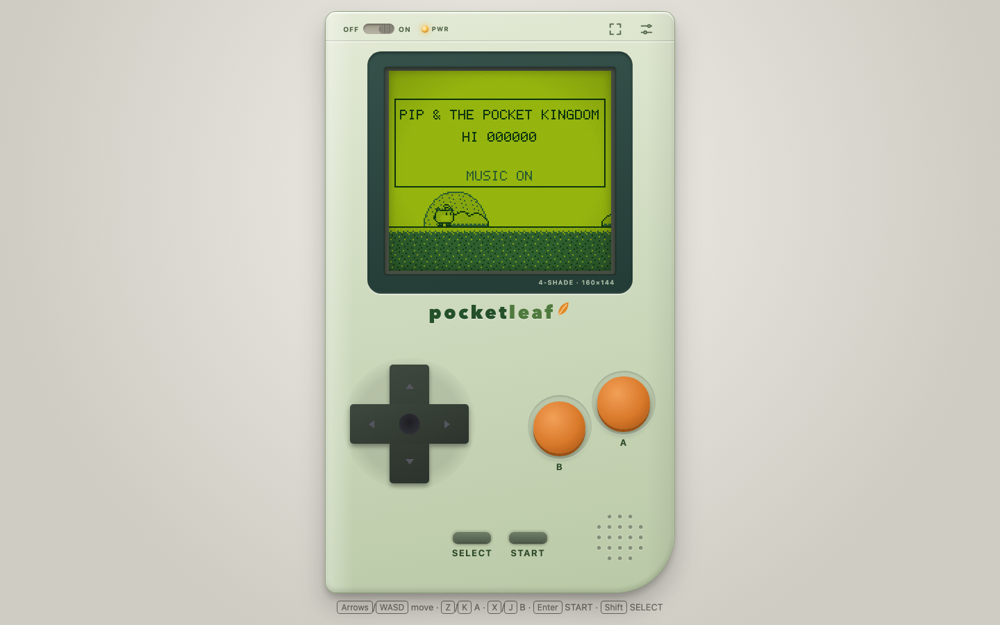
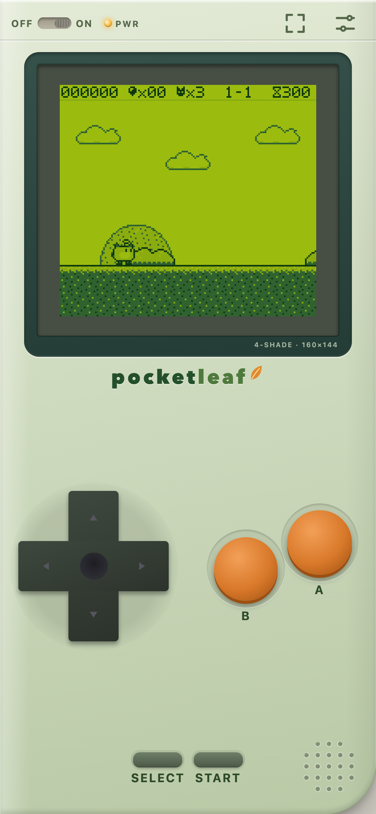
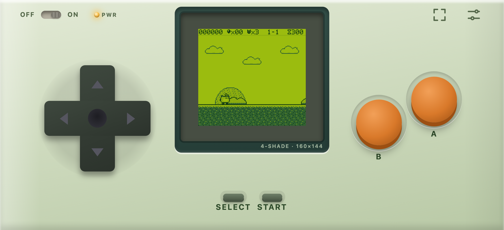

# Pip & the Pocket Kingdom

**A tiny, original pixel platformer that lives inside POCKETLEAF — a handheld console you play in
your browser.** Guide Pip, a small sprout with big ambitions, across three hand-made levels of grass,
caves and sky: stomp Mossbugs, dodge Snappers, time your jumps past Flutters, collect Glimmers and
reach the Beacon before the clock runs out.

**Live demo:** https://ysohaarsh.github.io/pocketleaf-pip/



## Screenshots

| 1-1 Sproutling Meadow                         | 1-2 Hollowroot Caverns                    | 1-3 Cloudstep Bridges                        |
| --------------------------------------------- | ----------------------------------------- | -------------------------------------------- |
|        |    |       |
| **Paused**                                    | **Pocket Grey palette**                   | **Title (desktop, LCD effects on)**          |
|  |  |  |

| Phone portrait (390×844)                                | Phone landscape                                           |
| ------------------------------------------------------- | --------------------------------------------------------- |
|  |  |

## Controls

| Action            | Keyboard             | Touch / mouse   | Gamepad (standard mapping)        |
| ----------------- | -------------------- | --------------- | --------------------------------- |
| Move              | Arrow keys / WASD    | D-pad           | D-pad or left stick               |
| Jump (A)          | Z or K               | A button        | Bottom face button (0)            |
| Run (B)           | X or J               | B button (hold) | Right (1) or left (2) face button |
| Start / pause     | Enter                | START           | Start (9)                         |
| Select            | Shift or Backspace   | SELECT          | Back / Select (8)                 |
| Skip boot / intro | any key / START or A | any button      | Start or A                        |

Hold A longer to jump higher; hold B to run and clear wider gaps.

## Features

- 160×144 screen, four shades, 16 px tiles, fixed 60 Hz simulation with integer-scaled, crisp
  pixels at any window size.
- Hero Pip with a Bloom power-up (Sun Seed), three enemy types (Mossbug, Snapper, Flutter),
  sparkle blocks, bricks, one-way platforms, spikes, pits, Glimmers and a Beacon at each level end.
- Game feel: separate ground/air acceleration, run button, variable jump height, coyote time and
  jump buffering (all tuning in `src/game/constants.ts`).
- Three hand-made levels (1-1 grass, 1-2 cave, 1-3 sky), each verified completable by a search bot.
- Four-channel chip-style synth built on Web Audio: original sound effects and songs.
- POCKETLEAF shell: D-pad, A/B, START/SELECT, power switch, power LED, speaker grille, fullscreen,
  settings (volume, mute, LCD effects, palette — "Classic" green or "Pocket Grey"), persisted locally.
- LCD effects: ghosting (quantised so the screen still shows exactly four shades), dot grid, grain
  and vignette.
- Keyboard, touch/mouse and gamepad input merged into one input state; on-screen buttons animate
  for every input source.
- Responsive: desktop, phone portrait and phone landscape.

## Tech stack & architecture

Vite · React 19 · TypeScript (strict) · Canvas 2D · Web Audio · Vitest · Playwright · GitHub Actions.

```
 ┌──────────────── React shell (src/shell, App.tsx) ────────────────┐
 │ Console ─ Screen(canvas + CSS LCD overlay) ─ Dpad ─ AB ─ Meta ─ Settings │
 │      │ useSyncExternalStore(host.subscribe/getSnapshot)            │
 │      │ useSyncExternalStore(host.input.subscribe/getHeld) → button depress │
 └──────┼───────────────────────────────────────────────────────────┘
        │ GameHost (src/engine/api.ts)
 ┌──────▼──────────── runtime.ts (DOM glue) ─────────────────────────┐
 │ loop.ts rAF + fixed-dt accumulator ─► input.sample() ─► step(world)│
 │ keyboard.ts / gamepad.ts / touch.ts ─► InputHub                    │
 │ world.events ─► AudioEngine (src/audio) / localStorage high score  │
 │ renderer.ts: rasterize(world) → Uint8Array 160×144 shades → blit   │
 │ debug/testHooks.ts → window.__GAME__ (dev or ?test=1)              │
 └──────┬────────────────────────────────────────────────────────────┘
        │ pure, deterministic
 ┌──────▼────────── src/game ───────────────────────────────────────┐
 │ world.ts createWorld/step (scene state machine in scenes/*)       │
 │ player.ts physics.ts collision.ts enemies.ts items.ts blocks.ts   │
 │ camera.ts levelParser.ts levels/*.ts constants.ts types.ts        │
 └───────────────────────────────────────────────────────────────────┘
```

- `src/game/**` is pure and deterministic (seeded PRNG, no DOM, no wall clock) and only knows
  palette indices 0..3; real colours exist only in the renderer.
- React is never in the frame loop: the engine owns its own `requestAnimationFrame` loop with a fixed
  60 Hz accumulator and exposes a small `GameHost` interface the shell subscribes to.
- See [docs/PLAN.md](docs/PLAN.md) for contracts and decisions.

## Run it locally (macOS)

```sh
brew install node   # Node.js LTS + npm
npm ci
npm run dev         # http://localhost:5173  (append ?test=1 for test mode)
```

`npm run build && npm run preview` serves the production build on http://localhost:4173.

## Testing

| Command                           | What it does                                                                                             |
| --------------------------------- | -------------------------------------------------------------------------------------------------------- |
| `npm run check`                   | typecheck → lint → unit tests → build → e2e (must be green to merge)                                     |
| `npm test`                        | Vitest unit tests (`npm run coverage` adds the coverage threshold)                                       |
| `npm run e2e`                     | Playwright on Chromium, WebKit and a mobile (touch) profile                                              |
| `npm run e2e:update`              | Re-record visual baselines — do this deliberately and review the diff                                    |
| `npx tsx scripts/genBotTracks.ts` | Re-run the search bot that proves every level is completable and rewrite `tests/fixtures/botTracks.json` |

The e2e suite runs against the production build and drives the game through `?test=1` (fixed seed,
LCD effects off, frozen animations, `window.__GAME__` probe). Visual baselines are stored **per
project and per platform** under `tests/e2e/__screenshots__/`, so macOS baselines never gate Linux;
CI generates its own Linux baselines via the manual `update-snapshots` job in
`.github/workflows/ci.yml`.

## Project structure

```
src/
  App.tsx, main.tsx   React entry
  shell/              POCKETLEAF console UI (buttons, screen, settings, toasts)
  engine/             runtime, loop, renderer, sprites, font, palettes, PRNG
  game/               pure simulation: world, physics, entities, scenes, levels
  input/              InputHub + keyboard / touch / gamepad sources
  audio/              Web Audio chip synth and songs
  debug/              test hooks (window.__GAME__)
tests/
  unit/               Vitest
  e2e/                Playwright specs + fixtures
docs/                 PLAN.md, screenshots
.github/workflows/    ci.yml, deploy.yml (GitHub Pages)
```

## Original IP

Pip, the Pocket Kingdom, POCKETLEAF and every sprite, tile, font glyph, sound effect and song in
this repository are original works created for this project, inspired by classic 1989-era handhelds.
No names, characters, art, audio, level layouts, fonts or logos from any existing game or console are
used.

## Credits

See [CREDITS.md](CREDITS.md).

## License

[MIT](LICENSE) © 2026 Pip & the Pocket Kingdom contributors.
